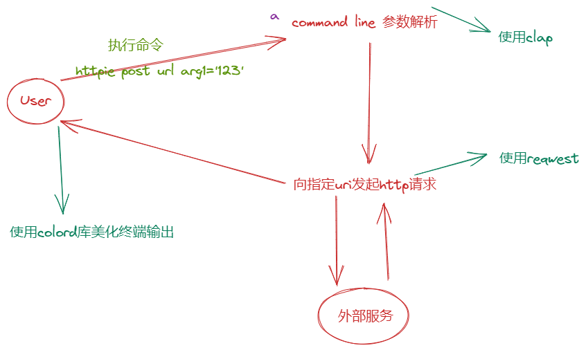

# HTTPie Design

## 架构

[HTTPie](https://github.com/wavty/rust-plus/blob/main/gethandsdirty/httpie/src/main.rs) is built in Rust, a systems programming language known for its speed, safety, and concurrency.



## 基础知识

### 1. `clap::Parser` 生成的常用属性

详见：https://docs.rs/clap/4.2.7/clap/_derive/_tutorial/index.html

| 属性名称        | 含义                   | 使用示例                                                                 | 解释                                                                                           |
| --------------- | ---------------------- | ------------------------------------------------------------------------ | ---------------------------------------------------------------------------------------------- |
| `about`         | 关于此程序的简短描述   | `#[command(about = "Simple program to greet a person")]`                 | 用于设置程序的简短描述，通常在帮助信息中使用                                                   |
| `author`        | 程序作者               | `#[command(author = "wavty")]`                                           | 用于设置程序的作者，通常在帮助信息中使用                                                       |
| `version`       | 程序版本               | `#[command(version)]`                                                    | 用于设置程序的版本，通常在帮助信息中使用                                                       |
| `long_about`    | 关于此程序的长描述     | `#[command(long_about = "This is a simple program to greet a person.")]` | 用于设置程序的长描述，通常在帮助信息中使用                                                     |
| `name`          | 程序的名字             | `#[command(name = "greet")]`                                             | 用于设置程序的名字，通常在帮助信息中使用                                                       |
| `arg`           | 定义一个命令行参数     | `#[arg(short, long)]`                                                    | 用于定义命令行参数的选项和标志，例如 `-h` 或 `--help`                                          |
| `subcommand`    | 定义一个子命令         | `#[command(subcommand)]`                                                   | 用于定义一个子命令，例如 `git commit` 中的 `commit` 子命令                                     |
| `group`         | 定义一组相互关联的参数 | `#[arg(group = "greeting")]`                                             | 用于定义一组相互关联的参数，例如 `--greeting hello --name World` 中的 `--greeting` 和 `--name` |
| `validator`     | 验证参数的有效性       | `#[arg(validator = validate_count)]`                                     | 用于定义验证参数的函数，例如检查参数是否在一定范围内                                           |
| `required`      | 声明参数为必需         | `#[arg(required = true)]`                                                | 用于声明参数为必需的，如果未提供则会引发错误                                                   |
| `default_value` | 设置参数的默认值       | `#[arg(default_value = "World")]`                                        | 用于设置参数的默认值，如果未提供参数，则使用此值                                               |

### 2. rust 的 MIME 类型指的是什么？

在 Rust 中，MIME 类型是指 Multipurpose Internet Mail Extensions（多用途 Internet 邮件扩展）类型的缩写，它是用于在互联网上传输各种类型的文件和数据的一种标准方式。MIME 类型以字符串的形式表示，通常使用扩展名或文件类型来确定给定文件的 MIME 类型。例如，MIME 类型"text/plain"通常与.txt 文件扩展名相关联。

### 3. clap4.2.7 如何使用 Subcommand

[Subcommands _tutorial](https://docs.rs/clap/4.2.7/clap/_derive/_tutorial/index.html#subcommands)

```rust
use clap::{Args, Parser, Subcommand};

/// A naive httpie implementation with Rust.
#[derive(Parser, Debug)]
#[command(version, author="wavty", about="httpie", long_about=None)]
struct Opts {
    /// httpie subcommand
    #[command(subcommand)]
    subcmd: Subcmd,
}

#[derive(Subcommand, Debug)]
enum Subcmd {
    Get(Get),
    Post(Post),
}

#[derive(Args, Debug)]
struct Get {
    /// HTTP request url
    url: String,
}

#[derive(Args, Debug)]
struct Post {
    /// HTTP request url
    url: String,
    /// HTTP request body
    body: Vec<String>,
}

fn main() {
    let args = Opts::parse();
    println!("{:?}", args);
}
// $ ./httpie.exe post baidu.com 123
// Opts { subcmd: Post(Post { url: "baidu.com", body: ["123"] }) }
```
