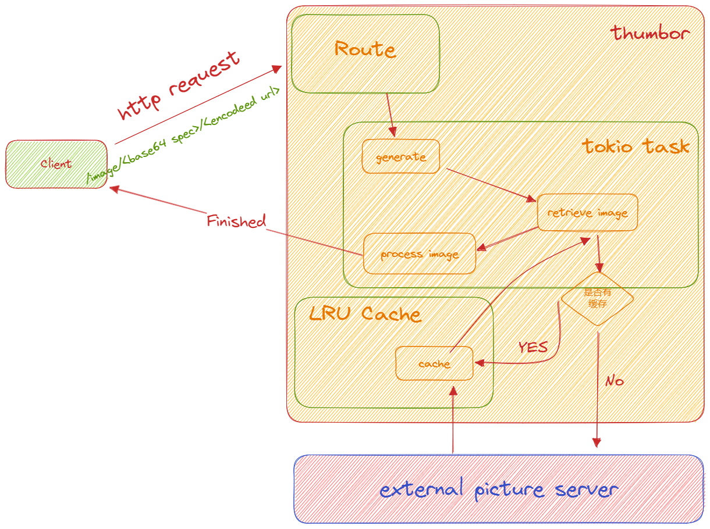

# 设计图片服务器 thumbor



## std::borrow 初窥

### 使用场景

| 设计原因                   | 使用场景                                                                                                              |
| -------------------------- | --------------------------------------------------------------------------------------------------------------------- |
| 支持对不可变数据的共享访问 | 在函数参数中使用借用，避免获取所有权<br>在数据结构中使用借用，以保持数据的不可变性                                    |
| 提高代码的可复用性         | 在函数参数中使用借用，使函数对数据的操作更通用<br>在实现自定义类型的 trait 时使用借用，与其他类型一样能够被借用和共享 |

### 举个栗子

**例子 1: 在函数参数中使用借用**

```rust
fn print_length(s: impl std::borrow::Borrow<str>) {
    println!("Length: {}", s.borrow().len());
}

fn main() {
    let string = String::from("Hello, world!");
    print_length(&string);
}
```

在这个例子中，`print_length` 函数的参数类型被改为了 `impl std::borrow::Borrow<str>`，这表示它可以接受任何实现了 `Borrow<str>` trait 的类型。这包括 `&str` 和 `String`。通过调用 `borrow()` 方法获取对 `str` 的借用，并使用 `len()` 方法获取其长度。

**例子 2: 在数据结构中使用借用**

```rust
struct Book {
    title: String,
    author: String,
}

impl Book {
    fn get_author(&self) -> &str {
        self.author.borrow()
    }
}

fn main() {
    let book = Book {
        title: String::from("The Catcher in the Rye"),
        author: String::from("J.D. Salinger"),
    };

    let author = book.get_author();
    println!("Author: {}", author);
}
```

在这个例子中，`get_author` 方法的返回类型被改为了 `&str`，通过调用 `borrow()` 方法获取对 `author` 字段的借用。这样做可以确保返回的是一个不可变的借用，而不是获取所有权。

这些例子展示了如何使用 `borrow()` 方法来获取借用，并在函数参数和数据结构中使用借用。通过使用 `borrow()` 方法，代码变得更加通用，可以接受更多类型的参数，并且保持对数据的借用而不是获取所有权。
